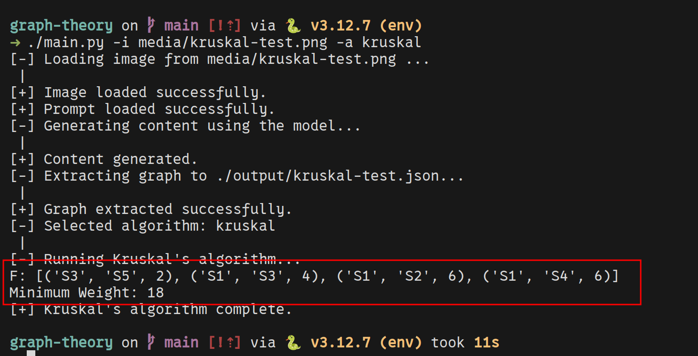

# Graph Theory TP Solver - ESI SBA

This project solves graph theory problems interactively by processing graph images or matrices. It walks through different graph algorithms, explaining each step along the way.

## Features
- Processes graph images and matrices.
- Implements common graph algorithms.
- Provides interactive walkthroughs with explanations.

## Requirements

Create a virtual environment and install dependencies:

```bash
pip install -r requirements.txt
```

## Usage

Here is the basic help

```bash
➜ ./main.py -h
usage: main.py [-h] -i INPUT -a ALGORITHM [-v VARIANT]

A versatile tool for reading and solving graph-related problems.

options:
  -h, --help            show this help message and exit
  -i INPUT, --input INPUT
                        Path to the input file containing the graph data. Supports image formats.
  -a ALGORITHM, --algorithm ALGORITHM
                        The algorithm to be applied
  -v VARIANT, --variant VARIANT
                        Specific variant of the chosen algorithm (if applicable).
```

Run the main script to start the application:

```bash
python main.py
```

## Screenshots


*Graph processing in action.*

### Important note

Make sure to replace the Gemini api key with Your own key to benefit from its image
processing capabilities.

Also, Gemini does its best at identifying graph images, but it is still very lacking.
If you feel you haven't got a suitable output, you can mess with `legacy.py` at your own
comfort OR access the generated `json` and correct it yourself.

---

Contribution is **ALWAYS OPEN!**

This project isn't finished yet and is part of my desire to help friends and students
visualize what they learn and make sense of it programmatically outside the theoratical aspect.
If you feel you can contribute, fork the repo and make a PR with your change involved.

